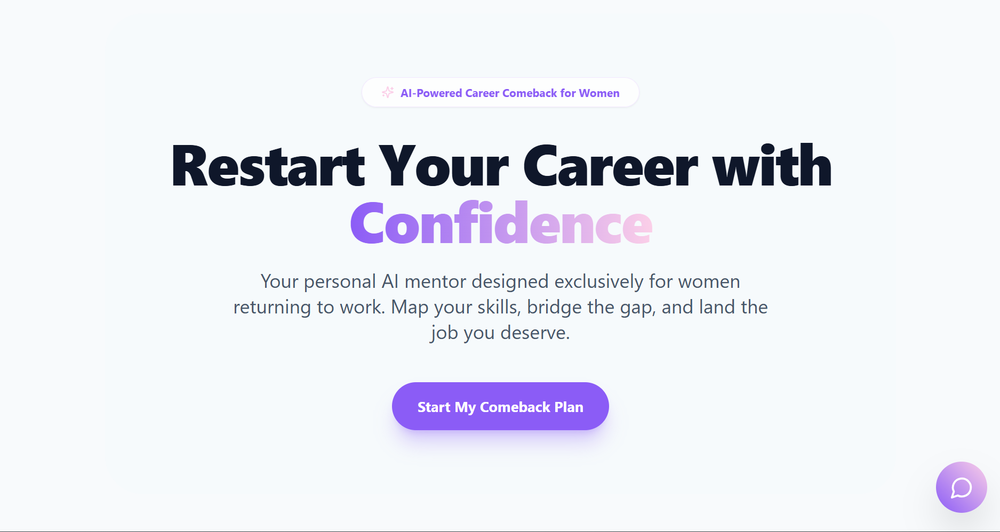
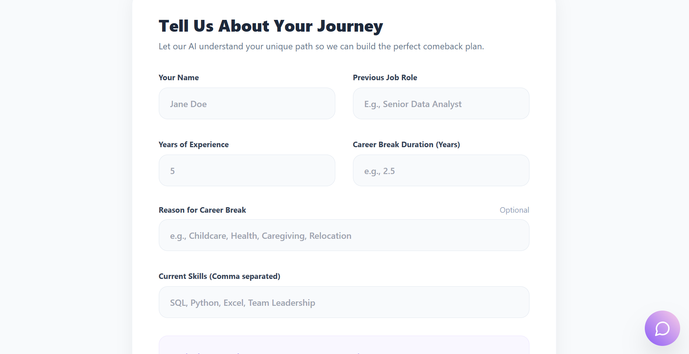
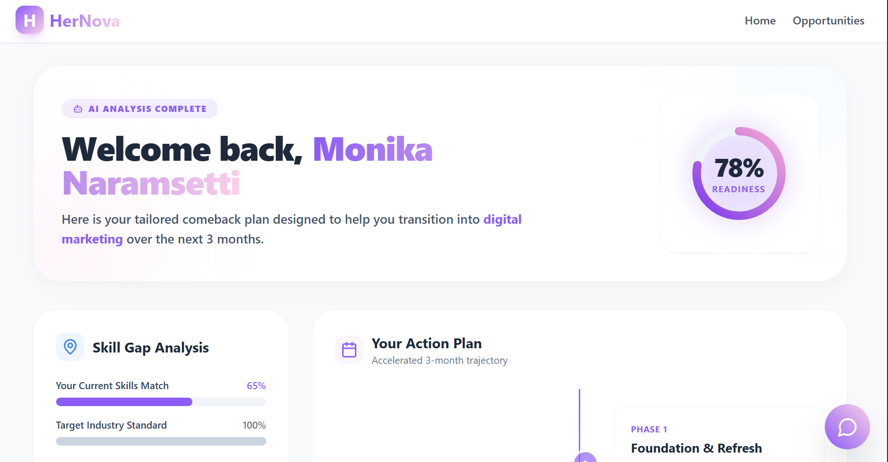
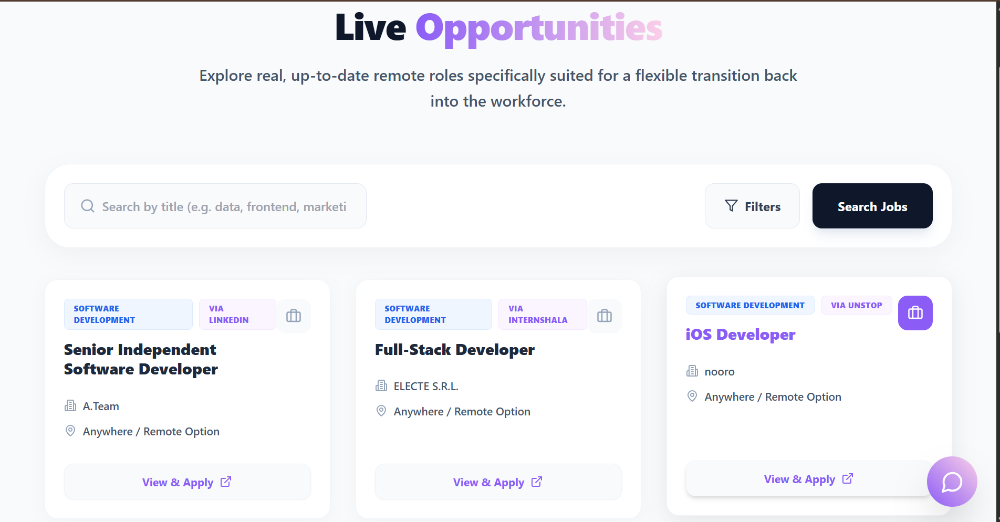

# HerNova - AI-Based Career Re-entry Assistant for Women

<div align="center">
  <h3>Empower Your Career Comeback with AI-Driven Guidance</h3>
  <p>Your personal AI mentor designed exclusively for women returning to work. Map your skills, bridge the gap, and land the job you deserve.</p>
</div>

---

## 📋 Table of Contents

- [About the Project](#about-the-project)
- [Features](#features)
- [Tech Stack](#tech-stack)
- [Screenshots](#screenshots)
- [Installation](#installation)
- [Usage](#usage)
- [Project Structure](#project-structure)
- [Contributing](#contributing)
- [License](#license)
- [Contact](#contact)

---

## 🎯 About the Project

**HerNova** is an innovative web application designed to help women returning to the workforce after a career break. Using AI-powered analysis, the platform provides personalized career re-entry plans, identifies skill gaps, and connects users with relevant job opportunities.

The application offers:
- **AI-Powered Career Analysis** - Comprehensive analysis of your career journey and skills
- **Personalized Action Plans** - Customized 3-month comeback trajectory
- **Skill Gap Identification** - Detailed assessment of skills needed vs. current expertise
- **Live Job Opportunities** - Remote-first positions suited for flexible transitions
- **Professional Mentoring** - AI mentor chat for guidance and support

---

## ✨ Features

✅ **Career Story Form**
- Capture detailed information about career break and background
- Input current skills and previous job roles
- Record years of experience and break duration

✅ **AI Analysis Dashboard**
- Personality-driven readiness score
- Skill gap analysis with visual progress bars
- Priority skills to learn
- Hidden strengths detection
- Comprehensive action plan with 3 phases

✅ **Structured Action Plan**
- **Phase 1: Foundation & Refresh** - Review industry updates and set up professional profiles
- **Phase 2: Networking** - Connect with professionals and attend virtual meetups
- **Phase 3: Aggressive Application** - Active job searching and applications

✅ **Job Opportunities Board**
- Real-time job listings filtered for women returners
- Remote-first positions emphasizing flexibility
- Easy application process via recruitment partners

✅ **AI Mentor Chat**
- 24/7 conversational AI support
- Personalized guidance and motivation
- Career advice and strategy discussions

---

## 🛠️ Tech Stack

### Frontend
- **React** 18.x - UI library
- **Vite** - Build tool and dev server
- **Tailwind CSS** - Utility-first CSS framework
- **PostCSS** - CSS transformation tool
- **Lucide React** - Icon library

### Development
- **Node.js** - JavaScript runtime
- **npm** - Package manager

---

## 📸 Screenshots

### 1. Landing Page

*Hero section introducing HerNova with call-to-action button*

### 2. Career Story Form

*Form to collect user information about career journey, skills, and career break*

### 3. AI Analysis Dashboard

*Personalized dashboard showing readiness score, skill gap analysis, and action plan*

### 4. Job Opportunities

*Live job listings tailored for women returning to the workforce*

---

## 🚀 Installation

### Prerequisites
- Node.js (v14 or higher)
- npm (v6 or higher)

### Clone the Repository
```bash
git clone https://github.com/monikanaramsetti/AI-Based-Career-Re-entry-Assistant-for-Women.git
cd AI-Based-Career-Re-entry-Assistant-for-Women
```

### Install Dependencies
```bash
npm install
```

### Environment Setup
Create a `.env` file in the root directory (if needed):
```env
VITE_API_URL=your_api_endpoint_here
```

---

## 💻 Usage

### Development Server
```bash
npm run dev
```
The application will start at `http://localhost:5173`

### Production Build
```bash
npm run build
```

### Preview Production Build
```bash
npm run preview
```

---

## 📁 Project Structure

```
frontend/
├── src/
│   ├── components/
│   │   ├── ChatMentor.jsx          # AI mentor chat component
│   │   ├── FormCard.jsx             # Reusable form card component
│   │   ├── HeroSection.jsx          # Home page hero section
│   │   ├── JobCard.jsx              # Job listing card component
│   │   ├── Layout.jsx               # Main layout wrapper
│   │   ├── MotivationCard.jsx       # Motivational message component
│   │   ├── ProgressCircle.jsx       # Circular progress indicator
│   │   ├── RoadmapTimeline.jsx      # Timeline for action plan
│   │   └── SkillGapCard.jsx         # Skill gap analysis card
│   │
│   ├── pages/
│   │   ├── AIAnalysisDashboard.jsx  # Main dashboard page
│   │   ├── CareerStoryForm.jsx      # Career information form page
│   │   ├── JobOpportunities.jsx     # Job listings page
│   │   └── LandingPage.jsx          # Home page
│   │
│   ├── App.jsx                      # Main app component
│   ├── main.jsx                     # Entry point
│   └── index.css                    # Global styles
│
├── public/                          # Static assets
├── index.html                       # HTML template
├── package.json                     # Dependencies and scripts
├── vite.config.js                   # Vite configuration
├── tailwind.config.js               # Tailwind CSS configuration
├── postcss.config.js                # PostCSS configuration
└── README.md                        # This file
```

---

## 🎨 Color Scheme & Design

- **Primary Purple**: `#7C3AED` - Brand color
- **Light Background**: `#F9FAFB` - Clean, minimal interface
- **Dark Text**: `#1F2937` - High readability
- **Accent Colors**: Gradients for visual interest

---

## 🤝 Contributing

Contributions are welcome! To contribute to HerNova:

1. Fork the repository
2. Create a feature branch (`git checkout -b feature/AmazingFeature`)
3. Commit your changes (`git commit -m 'Add some AmazingFeature'`)
4. Push to the branch (`git push origin feature/AmazingFeature`)
5. Open a Pull Request

---

## 📝 License

This project is licensed under the MIT License - see the LICENSE file for details.

---

## 👤 Contact

**Author**: Monika Naramsetti
- **Email**: naramsettimonika@gmail.com
- **GitHub**: [@monikanaramsetti](https://github.com/monikanaramsetti)
- **Repository**: [AI-Based-Career-Re-entry-Assistant-for-Women](https://github.com/monikanaramsetti/AI-Based-Career-Re-entry-Assistant-for-Women)

---

## 🙏 Acknowledgments

- Designed for women returning to the workforce
- Built with care to bridge the career comeback gap
- Powered by AI-driven insights and human-centered design

---

<div align="center">
  <p><strong>HerNova</strong> - Restart Your Career with Confidence 💜</p>
</div>
